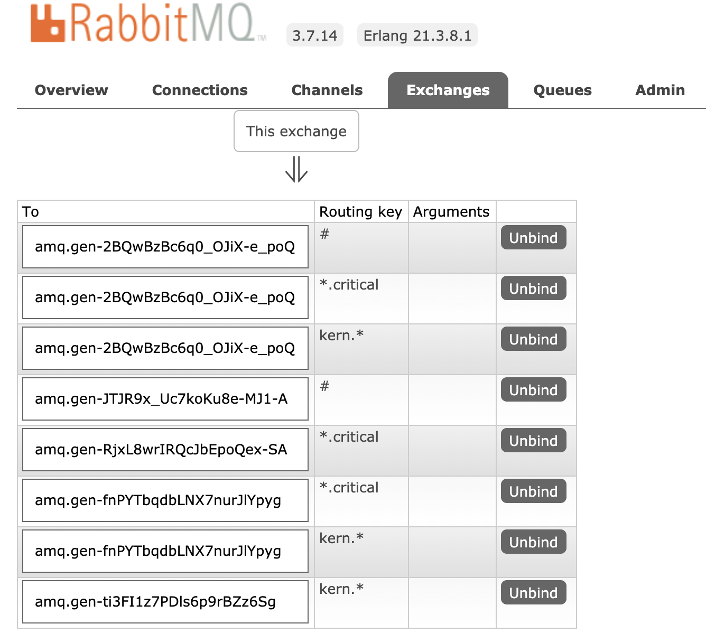

# Publicar y Consumir Tópicos de RabbitMQ con Node JS

### Basado en:

(Con correcciones y algunos detalles mas)

* Get Started RabbitMQ Node JS:

https://www.rabbitmq.com/tutorials/tutorial-five-javascript.html

### Ver Repo con el Receptor en:

* https://github.com/diegochavezcarro/node-rabbit-topic-receive 

### Pasos:

* Se levanta Rabbit con Docker, si no se tiene Docker instalarlo previamente (https://docs.docker.com/install/). Luego:

docker run -d --hostname rabbitmq --name rabbitmq -p 15672:15672 -p 5672:5672 rabbitmq:3.7.14-management

* En http://localhost:15672/ se puede ver la consola, acceder con guest/guest

* Primero ejecutar el Receptor del otro Repo. Ir probando estas diferentes opciones (probar de a una o ir levantando en una nueva consola cada caso, pudiendo de esa manera probar todos juntos):

node receive_logs_topic.js "#"

node receive_logs_topic.js "kern.*"

node receive_logs_topic.js "*.critical"

node receive_logs_topic.js "kern.*" "*.critical" 

node receive_logs_topic.js "#" "kern.*" "*.critical" 

* Luego probar las siguientes opciones para el emisor:

node emit_log_topic.js "kern.critical" "Mensaje"

node emit_log_topic.js "bla.critical" "Mensaje"

node emit_log_topic.js "kern.bla" "Mensaje"

node emit_log_topic.js "bla.bla" "Mensaje"

* Tambien se pueden ver los bindings en el Dashboard:

